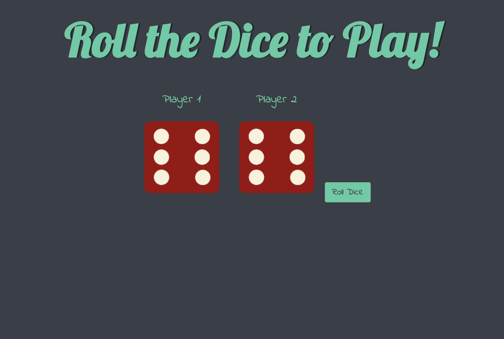

# Dice Duel Game: <a href="https://66b080649e097e9024ed7df7--tangerine-moxie-6eb2ad.netlify.app/" target="_blank">Visit Here</a>

Ever argue with your sibling over who has to wash the dishes? Dice Duel settles those pesky disputes with a roll of the dice – let chance decide who gets dish duty! With animated rolls and instant results, it's the fun way to resolve chores or just have a good laugh with friends.

## Tech used: 

## Optimizations

<li>Add a debounce function to the roll button click event to prevent multiple rapid clicks, ensuring smoother animations and preventing logic errors.</li>
<li>Add a leaderboard to track and display the highest scores and most wins, enhancing the competitive aspect of the game.</li>
<li>Optimize the layout and design for various screen sizes to ensure a seamless experience on both desktop and mobile devices.</li>
<li>Introduce sound effects for rolling dice and announcing winners to make the gameplay more immersive and enjoyable.</li>
<li>Implement an online multiplayer mode where players can compete with friends or other players from around the world in real-time.</li>

## Lessons Learned:

<li>The importance of planning and structuring a project effectively from the start, including defining features, design elements, and a development timeline.</li>
<li>The necessity of thorough testing and debugging to ensure the app works correctly across different browsers and devices.</li>
<li>Enhanced proficiency in JavaScript, including the use of modern ES6+ features, event handling, and DOM manipulation.</li>
<li>The benefits of writing modular, reusable code that is easier to maintain, debug, and extend with new features.</li>